# Rasberry Pi Setup Guide
Follow the steps below to setup and configure a Raspberry Pi 4 with a SenseHat and Camera for the Smart Recycle Kit

## Setting up a Raspberry Pi for the first time

If you are setting up a Raspberry Pi for the first time, you must follow all of these steps. Otherwise, you can skip to step 9. However, we recommend that you re-image your Raspberry Pi and follow these instructions.

1. Download and install an SD card formatter such as [SD Memory Card Formatter](https://www.sdcard.org/downloads/formatter_4/index.html) or [PiBakery](http://www.pibakery.org/download.html). Insert the SD card into your computer. Start the program and choose the drive where you have inserted your SD card. You can perform a quick format of the SD card.

1. Download the [Raspbian Buster](https://downloads.raspberrypi.org/raspbian/images/raspbian-2020-02-14/) operating system as a zip file.

1. Using an SD card-writing tool (such as [Etcher](https://etcher.io/)), follow the tool's instructions to flash the downloaded zip file onto the SD card. Because the operating system image is large, this step might take some time. Eject your SD card from your computer, and insert the microSD card into your Raspberry Pi.

1. For the first boot, we recommend that you connect the Raspberry Pi to a monitor (through HDMI), a keyboard, and a mouse. Next, connect your Pi to a USB-C power source and the Raspbian operating system should start up.

    1. When prompted with "Welcome to Raspberry Pi", Press **Next**.
    
        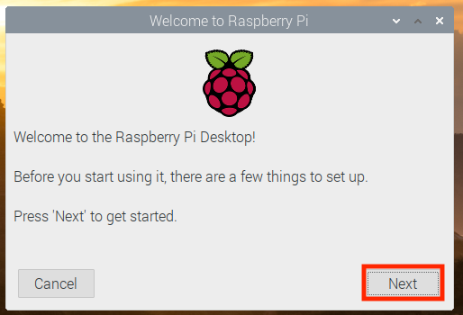
    
    1. Set Country, Language, and Timezone and Press **Next**.

        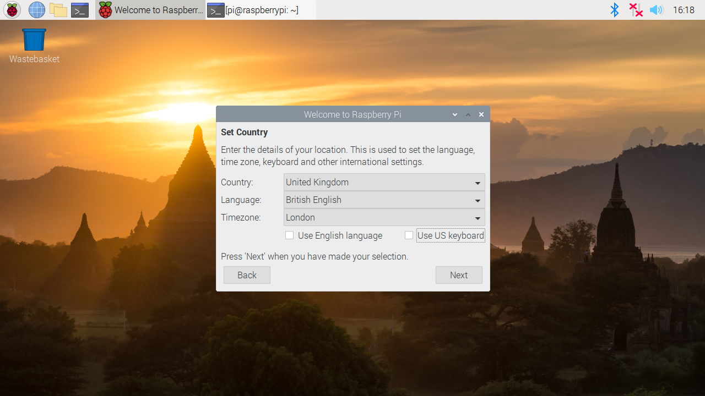
    
    1. Change the default 'pi' password and Press **Next**.

        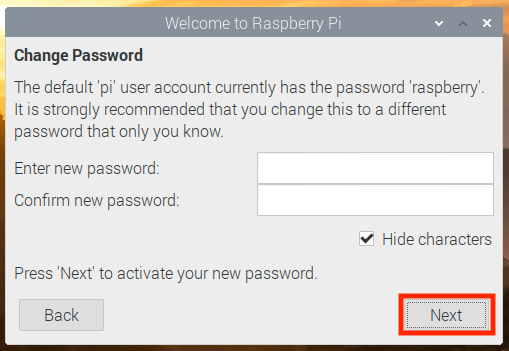
    
    1. Do you see a black border around your screen?  If so chaeck the box and Press **Next** to save the setting.

        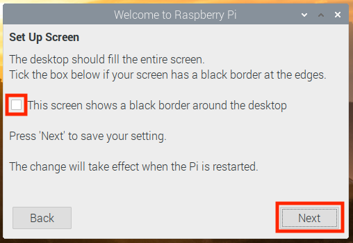
    
    1. Select your WiFi Network and Press **Next**.

        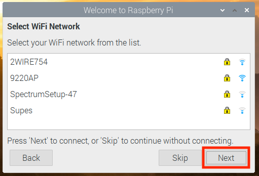
    
    1. Enter your WiFi Network Password and Press **Next**.

        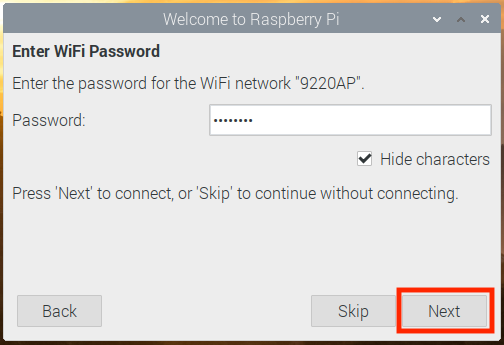
    
    1. The Raspberry Pi software will be updated in a later step, so when prompted with Update Software Press **Skip**.

        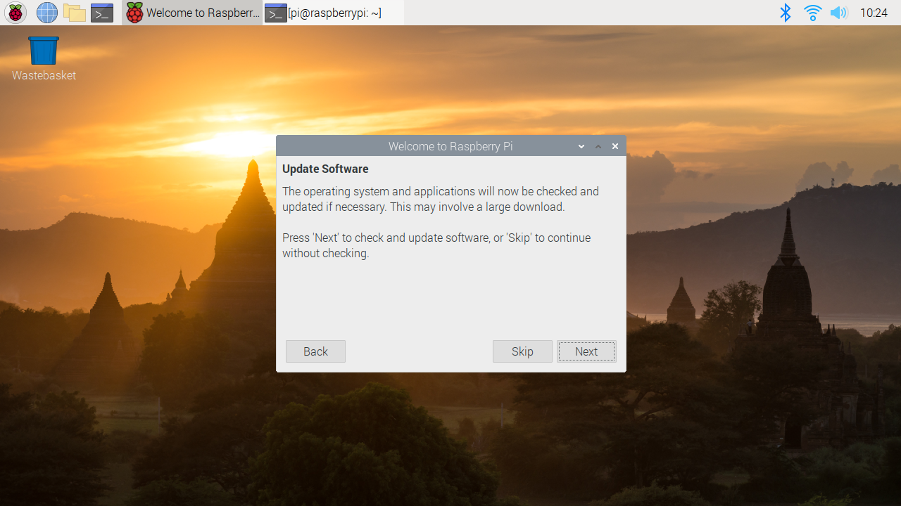
    
    1. There are a few more settings that need to be updated, so Press **Later** when prompted to 'Restart'.

        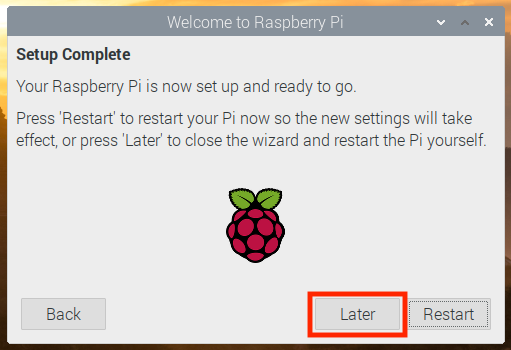
    
    1. Open "Raspberry Pi Configuration" by **Selecting** the Raspberry Menu Button in the upper left corner. The **Select** "Preferences", then **Selecting** Raspberry Pi Configuration.

        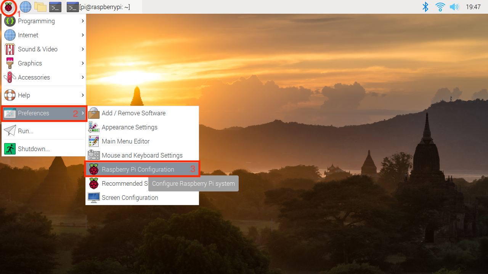

        1. Select the **Interfaces** tab.

            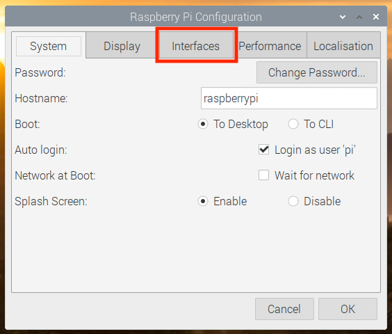

        1. Select the **Enable** Radio buttons for **Camera** and **SSH** to enable these Interfaces.

            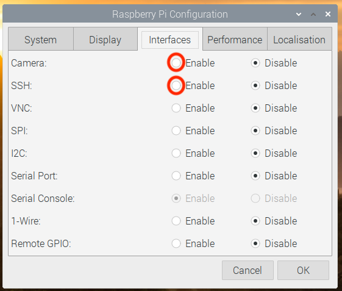

        1. Press **OK** to save the changes.

            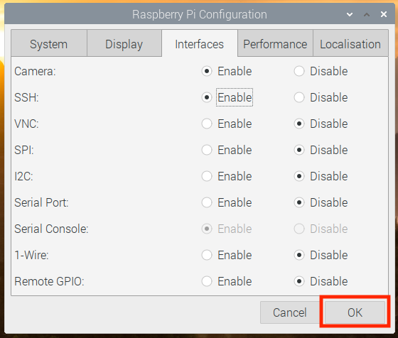

        1. Since there is one more piece of information we need to get, press **No** to "Would you like to Reboot Now?".

            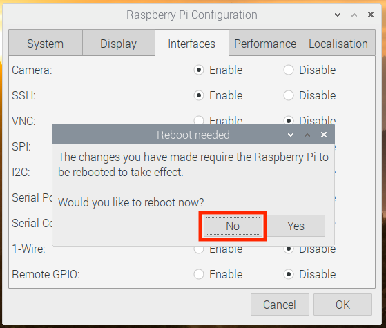
    
    1. Open a terminal window and enter the command `hostname -I` to return the IP Address of the Raspberry Pi.  Make a note of this IP Address as this will be used later to SSH to the Raspberry Pi.

        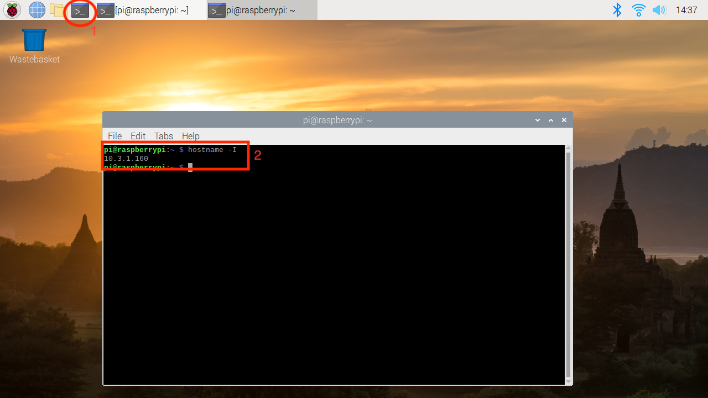

    1. Now that all of the initial configuration steps have been performed on the Raspberry Pi, it is time to reboot the Raspberry Pi.  Type `sudo reboot` in the terminal window.

        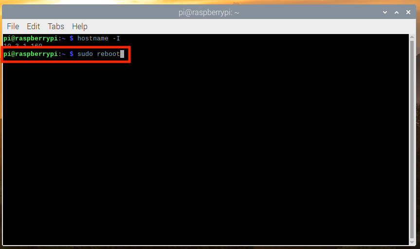

1. Once the Raspberry Pi finishes rebooting, we want to connect using SSH to the IP Address returned from the `hostname -I` command.

    1. If you are using MacOS, open a terminal window and enter the following:

    ``
        `ssh pi@IP-address`

    ``

