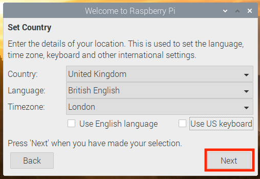
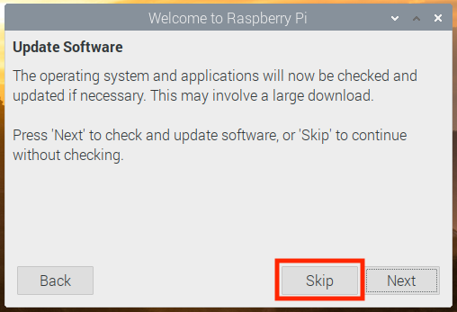

# Rasberry Pi Setup Guide
Follow the steps below to setup and configure a Raspberry Pi 4 with a SenseHat and Camera for the Smart Recycle Kit

## Setting up a Raspberry Pi for the first time

If you are setting up a Raspberry Pi for the first time, you must follow all of these steps. Otherwise, you can skip to step 8. However, we recommend that you re-image your Raspberry Pi and follow these instructions.

1. Download and install an SD card formatter such as [SD Memory Card Formatter](https://www.sdcard.org/downloads/formatter_4/index.html) or [PiBakery](http://www.pibakery.org/download.html). Insert the SD card into your computer. Start the program and choose the drive where you have inserted your SD card. You can perform a quick format of the SD card.

1. Download the [Raspbian Buster](https://downloads.raspberrypi.org/raspbian/images/raspbian-2020-02-14/) operating system as a zip file.

1. Using an SD card-writing tool (such as [Etcher](https://etcher.io/)), follow the tool's instructions to flash the downloaded zip file onto the SD card. Because the operating system image is large, this step might take some time. Eject your SD card from your computer, and insert the microSD card into your Raspberry Pi.

1. For the first boot, we recommend that you connect the Raspberry Pi to a monitor (through HDMI), a keyboard, and a mouse. Next, connect your Pi to a USB-C power source and the Raspbian operating system should start up.

    1. When prompted with "Welcome to Raspberry Pi", Press **Next**.
    
        
    
    1. Set Country, Language, and Timezone and Press **Next**.

        
    
    1. Change the default 'pi' password and Press **Next**.

        
    
    1. Do you see a black border around your screen?  If so chaeck the box and Press **Next** to save the setting.

        
    
    1. Select your WiFi Network and Press **Next**.

        
    
    1. Enter your WiFi Network Password and Press **Next**.

        
    
    1. The Raspberry Pi software will be updated in a later step, so when prompted with Update Software Press **Skip**.

        
    
    1. There are a few more settings that need to be updated, so Press **Later** when prompted to 'Restart'.

        
    
    1. Open "Raspberry Pi Configuration" by **Selecting** the Raspberry Menu Button in the upper left corner. The **Select** "Preferences", then **Selecting** Raspberry Pi Configuration.

        

        1. Select the **Interfaces** tab.

            

        1. Select the **Enable** Radio buttons for **Camera** and **SSH** to enable these Interfaces.

            

        1. Press **OK** to save the changes.

            

        1. Since there is one more piece of information we need to get, press **No** to "Would you like to Reboot Now?".

            
    
    1. Open a terminal window and enter the command `hostname -I` to return the IP Address of the Raspberry Pi.  Make a note of this IP Address as this will be used later to SSH to the Raspberry Pi.

        

    1. Now that all of the initial configuration steps have been performed on the Raspberry Pi, it is time to reboot the Raspberry Pi.  Type `sudo reboot` in the terminal window.

        

1. Once the Raspberry Pi finishes rebooting, connect using SSH to the IP Address returned from the `hostname -I` command.

    1. If you are using MacOS, open a terminal window and enter the following:


    ```bash

    ssh pi@IP-address
    
    ```

    1. If you are using Windows, you need to install and configure [PuTTY](https://www.chiark.greenend.org.uk/~sgtatham/putty/latest.html). Expand Connection, choose Data, and make sure that Prompt is selected:

       

    1. Next, choose **Session**, enter the IP address of the Raspberry Pi, and then choose **Open** using default settings.

       

    1. If a PuTTY security alert is displayed, choose Yes.  The default Raspberry Pi login is `pi` and use the password specified earlier.

       

1. Using the SSH connection established above, we will upgrade the software on the Raspberry Pi by entering the two commands below.  This step will take some time to complete.

    ```bash

    sudo apt update
    
    sudo apt -y upgrade    
    
    ```

1. Once the upgrades are done, reboot the Raspberry Pi. You will be able to reconnect using SSH in about a minute.
    ```bash

    sudo reboot
    
    ```
1. You are now ready to set up the Raspberry Pi for AWS IoT Greengrass. First, run the following commands from a local Raspberry Pi terminal window or an SSH terminal window:
    ```bash

    sudo adduser --system ggc_user
    sudo addgroup --system ggc_group

    ```
1. To improve security on the Pi device, enable hardlink and softlink (symlink) protection on the operating system at startup.

    1. Navigate to the `98-rpi.conf` file.

        ```bash

        cd /etc/sysctl.d
        ls
    
        ```
        
    1. Use a text editor (such as Leafpad, GNU nano, or vi) to add the following two lines to the end of the file. You might need to use the sudo command to edit as root (for example, `sudo nano 98-rpi.conf`).

        ```bash

        fs.protected_hardlinks = 1
        fs.protected_symlinks = 1  
        ```
    
    1. Reboot the Raspberry Pi.
        ```bash

        sudo reboot
    
        ```
        
        After about a minute, connect to the Pi using SSH and then run the following command to confirm the change:
    
        ```bash

        sudo sysctl -a 2> /dev/null | grep fs.protected

        ```

        You should see `fs.protected_hardlinks = 1` and `fs.protected_symlinks = 1`.
        
1. Edit your command line boot file to enable and mount memory cgroups. This allows AWS IoT Greengrass to set the memory limit for Lambda functions. Cgroups are also required to run AWS IoT Greengrass in the default [containerization](https://docs.aws.amazon.com/greengrass/latest/developerguide/lambda-group-config.html#lambda-containerization-considerations) mode.
    1. Navigate to your boot directory.
    ```bash

    cd /boot/

    ```

    1. Use a text editor to open `cmdline.txt`. Append the following to the end of the existing line, not as a new line. You might need to use the sudo command to edit as root (for example, `sudo nano cmdline.txt`).
    ``` bash

    cgroup_enable=memory cgroup_memory=1

    ```

   1. Reboot the Raspberry Pi.
    ```bash

    sudo reboot
    
    ```
    Your Raspberry Pi should now be ready for AWS IoT Greengrass.

1. To make sure that you have all required dependencies, reconnect to the Raspberry Pi, download and run the Greengrass dependency checker from the [AWS IoT Greengrass Samples](https://github.com/aws-samples/aws-greengrass-samples) repository on GitHub. These commands unzip and run the dependency checker script in the Downloads directory.

```bash
cd /home/pi/Downloads
mkdir greengrass-dependency-checker-GGCv1.11.x
cd greengrass-dependency-checker-GGCv1.11.x
wget https://github.com/aws-samples/aws-greengrass-samples/raw/master/greengrass-dependency-checker-GGCv1.11.x.zip
unzip greengrass-dependency-checker-GGCv1.11.x.zip
cd greengrass-dependency-checker-GGCv1.11.x
sudo modprobe configs
sudo ./check_ggc_dependencies | more
```

Where `more` appears, press the Spacebar key to display another screen of text.
